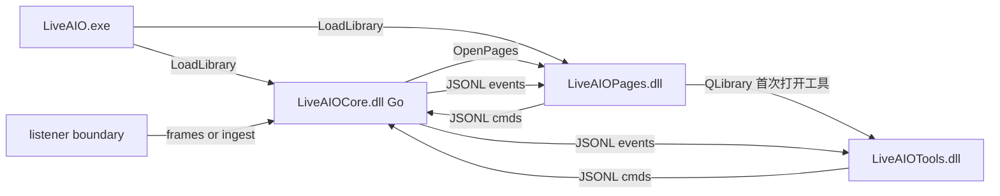

# C++ UI 对接约定（pages / tools）

> 面向 Plan 3/4 实现者。常量与字段以 [`protocol.go`](protocol.go) / [`models.go`](models.go) 为准；总契约见 [`CONTRACT.md`](CONTRACT.md)；样例见 [`protocol_examples.md`](protocol_examples.md)。  
> **只改本文件不足以改协议**——先改 Go 常量与 hub，再改文档。

---

## 硬规则（必须遵守）

```text
handshake: connect TCP 127.0.0.1:19877 → 收 ready → 收 capabilities(+features) → 收 status
pages: 发 connect/disconnect/status/config.*/ui.command；收 status/message/login.state/route.env/config.*
tools: 只消费 tick|ledger|danmu.show|memo.item；只发 tool.*.set|cmd|sim_gift（及可选 config.*）
禁止: 本地再过滤业务；直写 config.json；自造第二套 op 名；再解析 protobuf
生命周期: 关窗 = 断 IPC 不杀 Core；显式退出 = shutdown 或 ui.command quit.shutdown_all
资源: resources/image|gift|skin；C++ 读接口 resources/cpp/*.cpp
产物: LiveAIOPages.dll / LiveAIOTools.dll（由 LiveAIO.exe 加载）；无 LiveAIOUI.exe、无任何业务 Python
```

---

## 数据面



**加载链（生产）：** `LiveAIO.exe` → `LiveAIOCore.dll` → `LiveAIOPages.dll`（`OpenPages`）→ 进入 Tools 页 `QLibrary::load` `LiveAIOTools.dll` 并 **`LiveAIO_ToolsWarm` 预连 Core** → 用户点「打开」才建工具设置窗。宿主 **不** 直接加载 Tools。

**双 TCP：** Pages 与 Tools 各持一条 `127.0.0.1:19877` 连接（同进程内两条 socket）。工具事件由 Core **广播**；Pages 侧对 `tick`/`ledger`/`danmu.show` 等可空转。

---

## 握手顺序

1. `QTcpSocket`（或等价）连上 `127.0.0.1:19877`
2. 读一行：`{"op":"ready","version":"0.1.0","protocol_version":"0.1.0"}`
3. 读一行：`{"op":"capabilities","capabilities":{...},"features":{...}}`
4. 读一行：当前 `status`
5. 之后可发 `ping`；任意时刻按行解析，按 `op` 分发

忽略未知 `op`（向前兼容），不要因此断连。

---

## pages 职责

| 发 | 收 |
|----|----|
| `connect` / `disconnect` / `status` | `status` / `message` / `error` |
| `config.get` / `config.set` | `config.value` / `config.ok` / `error` |
| `ui.command`（登录、route.env、patch、退出） | `login.state` / `route.env` / `status` ack |
| `ping` | `pong` |

`connect` 字段：`live_id`（string）、`route`（`"1"`…`"4"`）、可选 `force_system`（bool）。

不要在 pages 里根据 `message` 做工具过滤；工具事件由 Core 直接推给 tools 连接（或同进程广播——以 hub `send` 为准：当前为**所有**已连接客户端广播 tool 事件与 `message`）。

---

## tools 职责

| 工具 | 只收 | 只发 |
|------|------|------|
| Overtime | `tick`, `ledger`, `status`（可选） | `tool.overtime.set`, `tool.overtime.cmd`, `tool.overtime.sim_gift` |
| Danmu | `danmu.show`, `status`（可选） | `tool.danmu.set` |
| Memo | `memo.item`, `status`（可选） | `tool.memo.set` |

设置 JSON 字段名必须与 Go `Normalize*Settings` 一致（见 CONTRACT §2.2）。

皮肤 / 礼物图标：

- 数据目录：`resources/skin/<tool>/<skin>/skin.json`、`resources/gift/`
- 读逻辑：[`resources/cpp/skin.cpp`](../resources/cpp/skin.cpp)、[`resources/cpp/gift.cpp`](../resources/cpp/gift.cpp)

---

## 懒加载矩阵（目标行为）

| 层级 | 行为 |
|------|------|
| 主侧栏页（Home / Tools / Settings） | placeholder；**导航时同步** `ensure*` 建页；启动 **预建 Home** |
| Home 线路 1–4 | **enterRoute 同步**建页；配置默认线路 **后台**预建；`route.env` 仅进入时发 |
| Settings 三个面板 | **点 Tab 同步** `ensurePanel` |
| `LiveAIOTools.dll` | Tools 页加载后 **`LiveAIO_ToolsWarm` 预连 Core + config/catalog** |
| 工具控制窗（1） | 每 id `ToolEntry`；关窗 **不杀 overlay**；`tryReleaseTool` 判定销毁 |
| 透明 overlay（2） | **每工具独立壳、同 Qt 实例复用**；关 overlay **不杀设置窗** |
| 礼物 catalog / 皮肤列表 | `ensureGiftCatalogAsync` + `warmToolCatalogs`；picker hide **release thumb** |
| 弹幕气泡 | 对象池复用；回池 `setParent(nullptr)`；unmount **drain 池** |

---

## 透明 overlay 双窗与生命周期（严丝合缝）

**双窗：** `OverlayHostService` 按工具持有独立 `SharedOverlayShell` +
每工具 `*OverlayController`。弹幕机与加班机可同时显示，但共享同一 QApplication、
ToolsSession、CoreClient、主题与配置桥。

**拉起（show）：**

1. 仅清理该工具自己壳内的旧 content：`detachContent(slot, prevClosed)`
2. 对应 `shell->prepare`（标题/几何 key）→ `mountRoot` → `show`
3. Controller 在 `show` 前 `root_=nullptr` 并 **new 新 Root**；`closedCb_` = `[unmount → tool onClosed]`

**拆解（detachContent / teardown）固定顺序：**

1. 对应工具 `shell->hide()`
2. 清除该工具自己的 `closedCb`
3. **notify**（controller `unmount`：释缓存、清气泡池、`root_=nullptr`、ledger 断回调）
4. `takeRoot()` → `WidgetDeferredDestroy` 分帧 `deleteLater`（禁止在 notify 之后仍访问 root）

**工具隔离：** 打开或关闭某一工具不得 detach、隐藏或修改另一工具的 shell。

**关闭路径：** 壳 ✕ → `teardown(closedCb_)`；工具按钮 → `teardown()`（同一 `closedCb_`）。禁止在 `teardown` 外重复 `unmount`。

**气泡池：** 回池时 `setParent(nullptr)`；`unmount` 时 `drainBubblePool`；复用前 `setParent(content)`。

---

## 工具四态生命周期（1=设置窗，2=透明 overlay）

`ToolsSession` 按 tool id 持 `ToolEntry { runtime, panel }`（memo 仅 panel）。

| 状态 | panel | overlay | 行为 |
|------|-------|---------|------|
| **12** | 存活 | 存活 | 互关不销毁对方 |
| **1** | 存活 | 无 | `ToolRuntime` 存活 |
| **2** | 无 | 存活 | runtime 继续收 `danmu.show`/`tick`/`ledger` |
| **无** | 无 | 无 | `tryReleaseTool` 销毁 runtime、移除 entry |

**释放条件：** `!panel && !runtime->isOverlayActive()` → `deleteLater(runtime)`。

**关设置窗：** `ToolWindowBase::closeEvent` → `onPanelClosing` → `hide` + `deleteLater(panel)`；**禁止**在 panel 析构里 `teardownFast`。

**关 overlay：** `teardown()` → `closedCb_` 末尾 `tryReleaseTool`。

---

## Config 预加载（tools 侧）

- 进入 Tools 页：`LiveAIO_ToolsWarm` → `ensureCore` + `installConfigBridge`
- 冷启动：`readConfigMap` 填入 `g_configCache`
- `ready` 后：`config.get` 全量合并；`config.value` / `config.ok` 持续更新缓存
- **写：** 乐观更新缓存 + `config.set`；未 `ready` 时 **入队**，`ready` 后 flush（不写本地回退）

---

## sharedGiftPicker（仅 overtime）

- **归属：** `GiftPickerPopup` 为 `ToolsSession` 子对象（`setGiftPickerParent`）
- **全局单 popup**；`openAt` 前隐式 hide；`setOnPicked` 每次 `openAt` 绑定（`QPointer` 守卫 panel）
- **关设置窗：** `hideSessionGiftPicker`
- **主题：** `LiveAIO_ToolsApplyTheme` → `picker.refreshTheme`
- overlay 开着、设置窗已关：无锚点，picker 不可用

---

## 礼物动图

礼物静图/动图：首帧同步 + 逐帧懒解码 + **有界缓存**（礼物几乎无动图；皮肤动图资源少）。不引入额外播放 SDK。

---

## Async-by-default

**允许同步阻塞 UI（须等 Core 回包）：**

- `connect` / `disconnect` / `connectLive`
- `route.env` 驱动线路页状态
- `login.query` / `login.start` → `login.state`
- IPC `ready` 前禁用依赖 core 的操作

**必须异步 / 分帧（不得阻塞主事件循环）：**

- `ensurePage` / `ensureTab` / `ensureRoutePage`（`deferNextTick` + 可选 `buildInChunks`）
- `QLibrary::load`（Tools DLL）
- `gift_info.json` / `listSkins`（`readJsonAsync` 或首次下拉）
- 礼物静图/动图解码（动图保持逐帧 `QTimer`）
- overlay / 大工具窗关闭拆解（`WidgetDeferredDestroy`）
- `onCorePacket` 内 **禁止** 重 UI 构建 → `singleShot(0)` 或分帧

**工具（`util/widgets.cpp`）：** `deferNextTick`、`ChunkBuilder`/`buildInChunks`、`readJsonAsync`、`WidgetDeferredDestroy`。

---

## 生命周期

| 用户动作 | UI 行为 | Core |
|----------|---------|------|
| 关页面/工具窗 | 断开 TCP | 继续跑（托盘） |
| 「打开界面」 | 重新连 TCP / 宿主再加载 DLL | 不变 |
| 托盘退出 / `quit.shutdown_all` / `shutdown` | 退出进程 | 停线路并退出 |

`quit.detach_ui`：仅确认 UI 可关，Core 不停。

---

## 源码与产物

| 源码 | 产物 |
|------|------|
| `pages/*.cpp` | `LiveAIOPages.dll` |
| `tools/*.cpp` | `LiveAIOTools.dll` |
| `build/host/main.cpp` | `LiveAIO.exe` |
| `core/` + `core/dll/` + `listener/` | `LiveAIOCore.dll` |

构建：[`build/build.ps1`](../build/build.ps1) → `build/build_work/custom/`（或 `-Release` 版本目录）。
