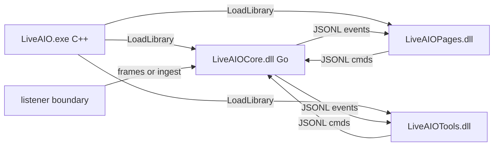

# C++ UI 对接约定（pages / tools）

> 面向 Plan 3/4 实现者。常量与字段以 [`protocol.go`](protocol.go) / [`models.go`](models.go) 为准；总契约见 [`CONTRACT.md`](CONTRACT.md)；样例见 [`protocol_examples.md`](protocol_examples.md)。  
> **只改本文件不足以改协议**——先改 Go 常量与 hub，再改文档。

---

## 硬规则（必须遵守）

```text
handshake: connect TCP 127.0.0.1:19877 → 收 ready → 收 capabilities(+features) → 收 status
pages: 发 connect/disconnect/status/config.*/ui.command；收 status/message/login.state/route.env/config.*
tools: 只消费 tick|ledger|danmu.show|memo.item；只发 tool.*.set|cmd|sim_gift（及可选 config.*）
禁止: 本地再过滤业务；直写 config.json；自造第二套 op 名；再解析 protobuf
生命周期: 关窗 = 断 IPC 不杀 Core；显式退出 = shutdown 或 ui.command quit.shutdown_all
资源: resources/image|gift|skin；C++ 读接口 resources/cpp/*.cpp
产物: LiveAIOPages.dll / LiveAIOTools.dll（由 LiveAIO.exe 加载）；无 LiveAIOUI.exe、无任何业务 Python
```

---

## 数据面



---

## 握手顺序

1. `QTcpSocket`（或等价）连上 `127.0.0.1:19877`
2. 读一行：`{"op":"ready","version":"0.1.0","protocol_version":"0.1.0"}`
3. 读一行：`{"op":"capabilities","capabilities":{...},"features":{...}}`
4. 读一行：当前 `status`
5. 之后可发 `ping`；任意时刻按行解析，按 `op` 分发

忽略未知 `op`（向前兼容），不要因此断连。

---

## pages 职责

| 发 | 收 |
|----|----|
| `connect` / `disconnect` / `status` | `status` / `message` / `error` |
| `config.get` / `config.set` | `config.value` / `config.ok` / `error` |
| `ui.command`（登录、route.env、patch、退出） | `login.state` / `route.env` / `status` ack |
| `ping` | `pong` |

`connect` 字段：`live_id`（string）、`route`（`"1"`…`"4"`）、可选 `force_system`（bool）。

不要在 pages 里根据 `message` 做工具过滤；工具事件由 Core 直接推给 tools 连接（或同进程广播——以 hub `send` 为准：当前为**所有**已连接客户端广播 tool 事件与 `message`）。

---

## tools 职责

| 工具 | 只收 | 只发 |
|------|------|------|
| Overtime | `tick`, `ledger`, `status`（可选） | `tool.overtime.set`, `tool.overtime.cmd`, `tool.overtime.sim_gift` |
| Danmu | `danmu.show`, `status`（可选） | `tool.danmu.set` |
| Memo | `memo.item`, `status`（可选） | `tool.memo.set` |

设置 JSON 字段名必须与 Go `Normalize*Settings` 一致（见 CONTRACT §2.2）。

皮肤 / 礼物图标：

- 数据目录：`resources/skin/<tool>/<skin>/skin.json`、`resources/gift/`
- 读逻辑：[`resources/cpp/skin.cpp`](../resources/cpp/skin.cpp)、[`resources/cpp/gift.cpp`](../resources/cpp/gift.cpp)

---

## 生命周期

| 用户动作 | UI 行为 | Core |
|----------|---------|------|
| 关页面/工具窗 | 断开 TCP | 继续跑（托盘） |
| 「打开界面」 | 重新连 TCP / 宿主再加载 DLL | 不变 |
| 托盘退出 / `quit.shutdown_all` / `shutdown` | 退出进程 | 停线路并退出 |

`quit.detach_ui`：仅确认 UI 可关，Core 不停。

---

## 源码与产物

| 源码 | 产物 |
|------|------|
| `pages/*.cpp` | `LiveAIOPages.dll` |
| `tools/*.cpp` | `LiveAIOTools.dll` |
| `build/host/main.cpp` | `LiveAIO.exe` |
| `core/` + `core/dll/` + `listener/` | `LiveAIOCore.dll` |

构建：[`build/build.ps1`](../build/build.ps1) → `build/build_work/custom/`（或 `-Release` 版本目录）。
